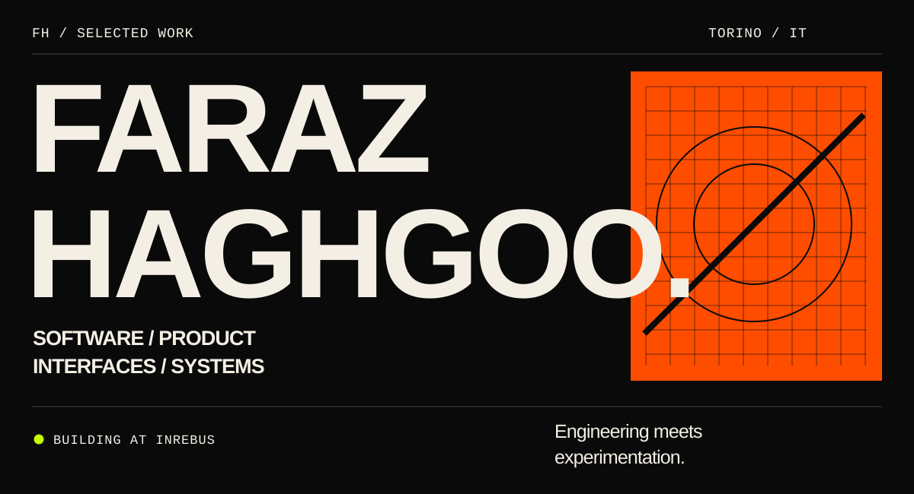
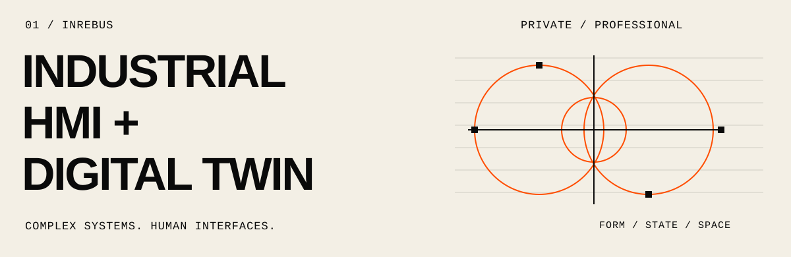
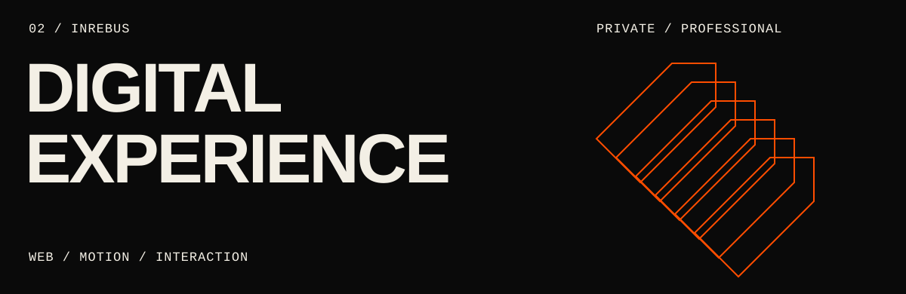
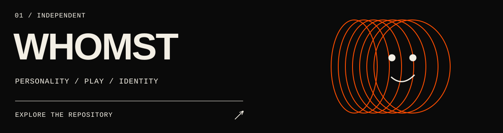
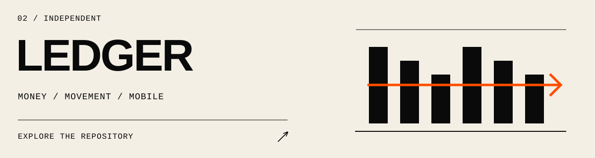
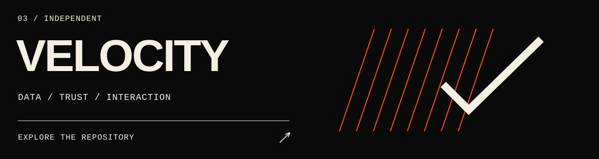
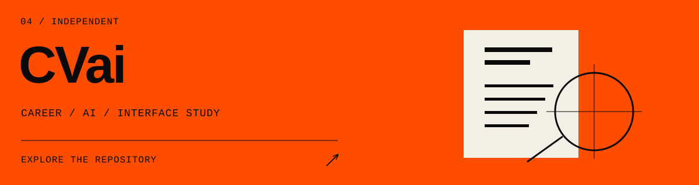
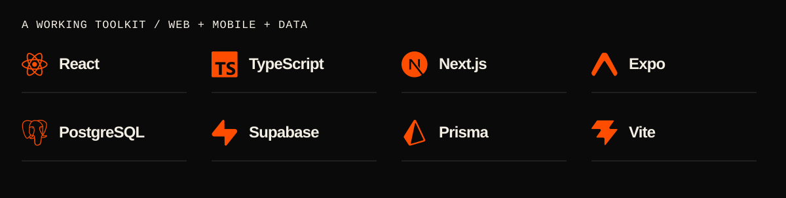
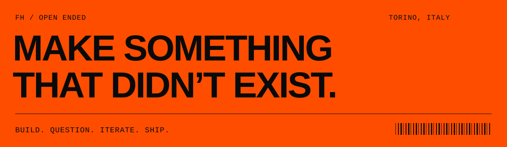

I’m **Faraz Haghgoo**, a developer and product builder based in **Turin, Italy**. I build digital products and complex interfaces where engineering, interaction and experimentation meet.

Currently working on professional software at **inRebus**. My public repositories are one part of that work.

[GitHub ↗](https://github.com/Farazhaghgoo) · [LinkedIn ↗](https://www.linkedin.com/in/faraz-haghgoo-6b4a64252)

### Industrial HMI / Digital Twin

**inRebus · Professional · Private repository**

Working on an industrial human–machine interface and digital-twin environment: making complex systems understandable through clear interfaces and technical visualization.

**Interface engineering · Interaction · Systems thinking**

### inRebus / Digital experience

**inRebus · Professional · Private repository**

Developing and redesigning the company’s web experience, connecting visual identity, responsive interfaces and purposeful motion.

**React · TypeScript · Vite · GSAP**

*Professional covers are abstract artwork. Source code and implementation details remain private.*

### [Whomst ↗](https://github.com/Farazhaghgoo/whomst)

A playful personality engine that matches answers to characters through vector-based scoring. The initial build connects the quiz, results and sharing, with server-side scoring and dynamic social images.

**Next.js · TypeScript · PostgreSQL · Prisma · Redis**

### [Ledger / financeApp ↗](https://github.com/Farazhaghgoo/financeApp)

Manual-first personal finance for cash spending, income and peer transfers. Built for iOS and Android, with optimistic, offline-tolerant writes and a clear distinction between spending and moving money.

**React Native · Expo · TypeScript · Supabase · TanStack Query**

### [VeloCity ↗](https://github.com/Farazhaghgoo/VeloCity)

A landing-page experience for data verification and secure data rooms. Combines expressive motion and responsive interfaces with a working waitlist backend.

**Next.js · React · TypeScript · GSAP · Framer Motion**

### [CVai / AI Career Partner ↗](https://github.com/Farazhaghgoo/CVai)

A career-product interface prototype exploring CV feedback, job matching and career insights. Uses mock data to study the experience of AI-assisted career tools.

**React · Vite · Tailwind CSS · SVG**

**Exploring:** AI-native products, human–computer interaction and product architecture.

**How I build:** understand the problem → shape the system → refine the interaction → ship and iterate.

[GitHub ↗](https://github.com/Farazhaghgoo) · [LinkedIn ↗](https://www.linkedin.com/in/faraz-haghgoo-6b4a64252) · **Turin, Italy**
