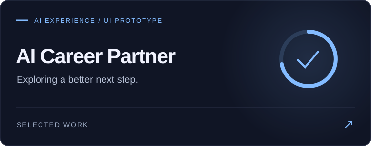

  

<h3 align="center">Curious enough to explore it. Hands-on enough to build it.</h3>

  
  
  

## A little about me

I’m **Faraz Haghgoo**, a developer and product-minded builder based in Turin. I enjoy the whole journey: shaping an idea, designing its interactions, building the backend, and making the pieces work together.

My work spans **full-stack web development, mobile apps, interactive interfaces, and AI-assisted product development**. I’m drawn to software that helps people learn, work, manage their lives, or discover something unexpected.

AI is part of how I research, code, and experiment. Understanding the result, making the decisions, and checking that it works are still part of the job.

<b>Product thinking &nbsp; × &nbsp; Engineering &nbsp; × &nbsp; Interface craft</b>

## Selected projects

<table>
<tr>
<td width="50%" valign="top">

A character-matching quiz powered by <b>12 trait dimensions</b>, server-side scoring, and shareable result pages.

<b>Engineering detail:</b> scoring stays on the server; dynamically generated preview images make results easy to share.

<code>Next.js</code> <code>TypeScript</code> <code>PostgreSQL</code> <code>Prisma</code> <code>Redis</code> <code>Zod</code> <code>Vitest</code>

<a href="https://github.com/Farazhaghgoo/whomst"><b>Explore Whomst ↗</b></a>

</td>
<td width="50%" valign="top">

A personal finance app for <b>cash spending and peer transfers</b>, built with optimistic updates and offline-tolerant writes.

<b>Product detail:</b> transfers are modeled separately from expenses. Moving money should not look like spending it.

<code>React Native</code> <code>Expo</code> <code>TypeScript</code> <code>Supabase</code> <code>PostgreSQL</code> <code>TanStack Query</code>

<a href="https://github.com/Farazhaghgoo/financeApp"><b>Explore Ledger ↗</b></a>

</td>
</tr>
<tr>
<td width="50%" valign="top">

A <b>UI prototype</b> exploring CV feedback, job matching, career insights, and cover-letter interactions with mock data.

<b>Interface detail:</b> custom SVG charts, animated feedback, and connected views for a complete career-workflow concept.

<code>React</code> <code>Vite</code> <code>Tailwind CSS</code> <code>SVG</code> <code>CSS Animations</code>

<a href="https://github.com/Farazhaghgoo/CVai"><b>Explore AI Career Partner ↗</b></a>

</td>
<td width="50%" valign="top">

A <b>landing-page experience</b> for data-verification and data-room workflows, with motion design and a working waitlist backend.

<b>Engineering detail:</b> shared validation and types keep frontend inputs aligned with backend expectations.

<code>Next.js</code> <code>React</code> <code>TypeScript</code> <code>Tailwind CSS</code> <code>GSAP</code> <code>Framer Motion</code> <code>Lenis</code>

<a href="https://github.com/Farazhaghgoo/VeloCity"><b>Explore VeloCity ↗</b></a>

</td>
</tr>
</table>

## Professional work

Alongside my public projects, I contribute to professional software projects whose details remain confidential.

## My toolkit

| Area | Technologies & practice |
| :--- | :--- |
| **Web & frontend** | React · Next.js · TypeScript · JavaScript · HTML5 · CSS3 · Vite |
| **Mobile** | React Native · Expo · TanStack Query · optimistic UI · offline-tolerant writes |
| **Backend & data** | PostgreSQL · Supabase · Prisma · Redis · REST APIs · data modeling |
| **Design & interaction** | Tailwind CSS · GSAP · Framer Motion · Lenis · SVG · Three.js · responsive interfaces |
| **Engineering** | Git · GitHub · Vitest · Zod · validation · testing · modular architecture |
| **Application security** | Session handling · row-level security · server-side validation · rate limiting |
| **Product & AI** | Product prototyping · UX decisions · AI-assisted research and development · AI interface experiments |
| **Deployment** | Vercel · frontend build tooling |

<b>How I approach a build</b>

- **Start with a real use case.** Decide what the person needs to accomplish before choosing the architecture.
- **Think across the product.** Connect the interface, data model, backend, and error states.
- **Give motion a job.** Use it to explain a transition or acknowledge an action.
- **Make boundaries explicit.** Validate inputs and decide who should have access to each piece of data.
- **Use AI with judgment.** Explore quickly, inspect the output, and verify behavior.
- **Keep experimenting.** A small working version teaches more than a long list of imagined features.

## Where my curiosity goes next

**AI-native products · Human–computer interaction · Creative interfaces · Startup ideas**

I’m interested in what happens when one person or a small team can build more ambitious software—and how that changes the way we work, learn, and create.

<b>Have an idea worth exploring?</b> <a href="https://www.linkedin.com/in/faraz-haghgoo-6b4a64252">Let’s connect on LinkedIn ↗</a>

