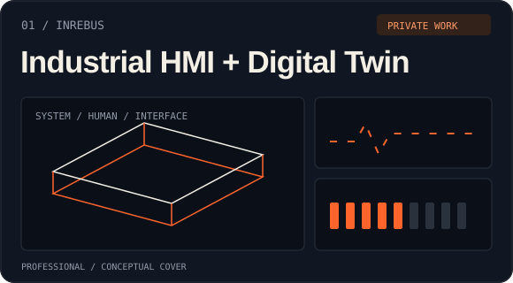
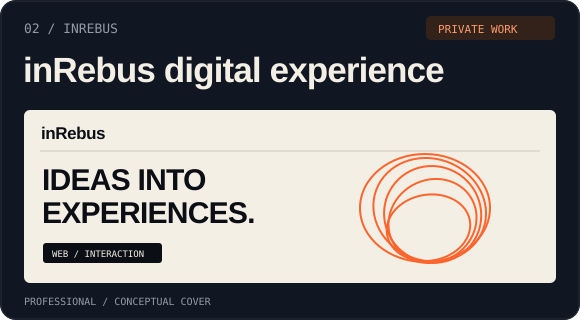
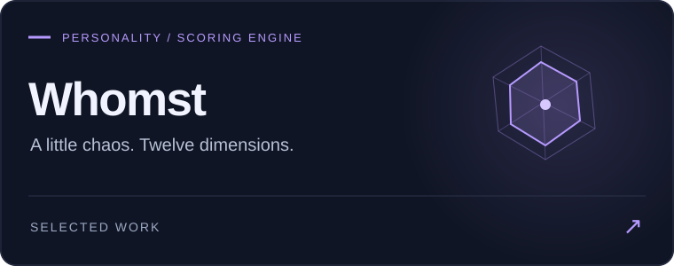
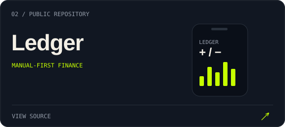
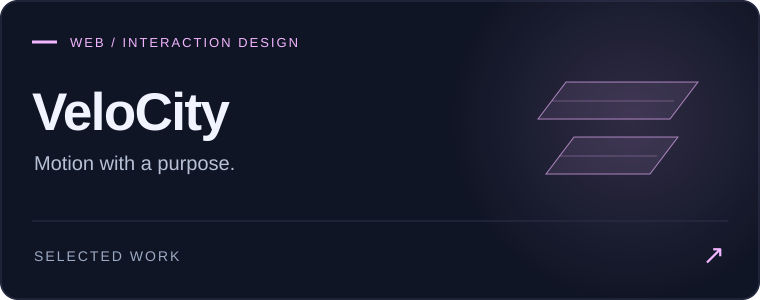
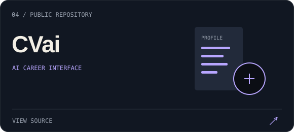
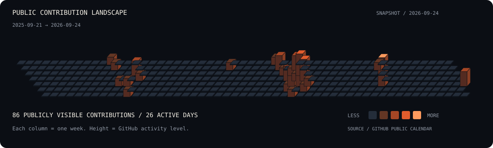

<picture>
  <source media="(prefers-reduced-motion: reduce)" srcset="assets/hero-static.svg">
  
</picture>

  <picture>
    <source media="(prefers-reduced-motion: reduce)" srcset="assets/typing-static.svg">
    
  </picture>

  
  &nbsp;
  

  I’m <strong>Faraz</strong>, a developer and product builder in <strong>Turin, Italy</strong>. 
  Industrial interfaces by day. Independent experiments whenever an idea won’t leave me alone. 
  I care about the system underneath, the interaction on top, and the details in between.

  <a href="#professional-work">Professional work</a> &nbsp; / &nbsp;
  <a href="#independent-projects">Projects</a> &nbsp; / &nbsp;
  <a href="#toolkit">Toolkit</a> &nbsp; / &nbsp;
  <a href="#public-activity">Activity</a>

<table>
<tr>
<td width="50%" valign="top">

<h3>Industrial HMI / Digital Twin</h3>

Making complex industrial systems understandable through human–machine interfaces and technical visualization.

<strong>Interface engineering · Interaction · Systems</strong>

inRebus · Professional · Private repository

</td>
<td width="50%" valign="top">

<h3>inRebus / Digital experience</h3>

Developing the company’s web experience through responsive interfaces, visual identity and purposeful motion.

<strong>React · TypeScript · Vite · GSAP</strong>

inRebus · Professional · Private repository

</td>
</tr>
</table>

Professional covers are original abstract artwork. Implementation details and source code remain private.

<table>
<tr>
<td width="50%" valign="top">

A playful personality engine. Vector-based scoring, shareable results and dynamic social images.

Next.js · TypeScript · PostgreSQL · Prisma · Redis

<a href="https://github.com/Farazhaghgoo/whomst"><strong>Explore Whomst ↗</strong></a>
</td>
<td width="50%" valign="top">

Money tracking for real life: cash spending, peer transfers and optimistic, offline-tolerant writes.

React Native · Expo · Supabase · TanStack Query

<a href="https://github.com/Farazhaghgoo/financeApp"><strong>Explore Ledger ↗</strong></a>
</td>
</tr>
<tr>
<td width="50%" valign="top">

A data-verification landing experience with expressive motion, responsive UI and a working waitlist backend.

Next.js · TypeScript · GSAP · Framer Motion

<a href="https://github.com/Farazhaghgoo/VeloCity"><strong>Explore VeloCity ↗</strong></a>
</td>
<td width="50%" valign="top">

A career-interface prototype exploring CV feedback, job matching and insights through mock-data interactions.

React · Vite · Tailwind CSS · SVG

<a href="https://github.com/Farazhaghgoo/CVai"><strong>Explore CVai ↗</strong></a>
</td>
</tr>
</table>

  

  <strong>Web</strong> / React + Next.js &nbsp; · &nbsp; <strong>Mobile</strong> / React Native + Expo 
  <strong>Data</strong> / PostgreSQL + Supabase &nbsp; · &nbsp; <strong>Motion</strong> / GSAP + Framer Motion

<strong>What keeps me curious</strong>

AI-native products, human–computer interaction, product architecture, and the moment a strange idea becomes something useful.

<strong>Understand → Build → Refine → Ship → Repeat.</strong>

A public snapshot, refreshed by the included workflow. My professional work happens in private repositories too.

Faraz Haghgoo / Turin, Italy &nbsp; · &nbsp; <a href="https://github.com/Farazhaghgoo">GitHub</a> &nbsp; · &nbsp; <a href="https://www.linkedin.com/in/faraz-haghgoo-6b4a64252">LinkedIn</a>

